# Quantium Enterprise Production Platform (Q-RECS Framework v3.0)

[](.github/workflows/ci.yml)
[](Dockerfile)
[](pyproject.toml)
[](#-data-contracts--schema-validation)
[](#-statistical-methodology--causal-engine)
[](LICENSE)

An enterprise-grade, MLOps/DataOps production platform built for **Retail Data Scientists, Econometricians, and Executive Decision-Makers**. The **Q-RECS Platform** combines **data contract schema auditing**, **asymptotic parametric cohort inference**, **synthetic control matching (SCME)**, **In-Space Placebo Permutation Tests (Abadie et al.)**, **difference-in-differences (DiD) causal impact modeling**, **Docker containerization**, **interactive Streamlit UI portals**, and **programmatic C-suite PDF reporting**.

---

## 📋 Table of Contents

- [🎥 Live Implementation Session & Interactive Demo](#-live-implementation-session--interactive-demo)
- [🖥️ Enterprise UI Screenshots & Decision Support Portal](#️-enterprise-ui-screenshots--decision-support-portal)
- [🏗️ MLOps Architecture & Pipeline Flow](#️-mlops-architecture--pipeline-flow)
- [🛡️ Data Contracts & Schema Validation](#️-data-contracts--schema-validation)
- [🔬 Statistical Methodology & Causal Engine](#-statistical-methodology--causal-engine)
- [📊 Behavioral Cohorting & Market Basket Analytics](#-behavioral-cohorting--market-basket-analytics)
- [📈 Trial Store Causal Impact Evaluations](#-trial-store-causal-impact-evaluations)
- [💻 Enterprise Streamlit Portal & ROI Simulator](#-enterprise-streamlit-portal--roi-simulator)
- [🛠️ Developer Automation & Execution Guide](#️-developer-automation--execution-guide)
- [📂 Repository Directory Structure](#-repository-directory-structure)
- [📄 Executive C-Suite PDF Slide Deck](#-executive-c-suite-pdf-slide-deck)

---

## 🎥 Live Implementation Session & Interactive Demo

The platform includes an automated recording of the **Streamlit Executive Decision-Support Portal**, demonstrating real-time interactive causal analysis, placebo permutation inspection, and enterprise ROI scenario simulation.

<div align="center">
  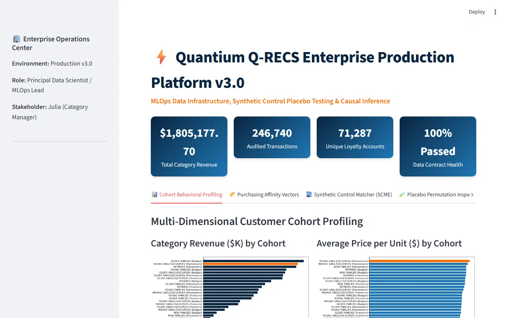
  <p><sub><b>Figure 1:</b> Interactive Browser Session Recording showing real-time Synthetic Control Matching, Placebo Permutation distribution inspection, and financial ROI parameter tuning.</sub></p>
</div>

---

## 🖥️ Enterprise UI Screenshots & Decision Support Portal

The **Q-RECS Streamlit Enterprise Portal** (`app.py`) provides C-suite executives and commercial lead analysts with an interactive interface for model inspection, audit trail verification, and financial decision support.

### 1. Operations Center & Cohort Behavioral Profiling Header
<div align="center">
  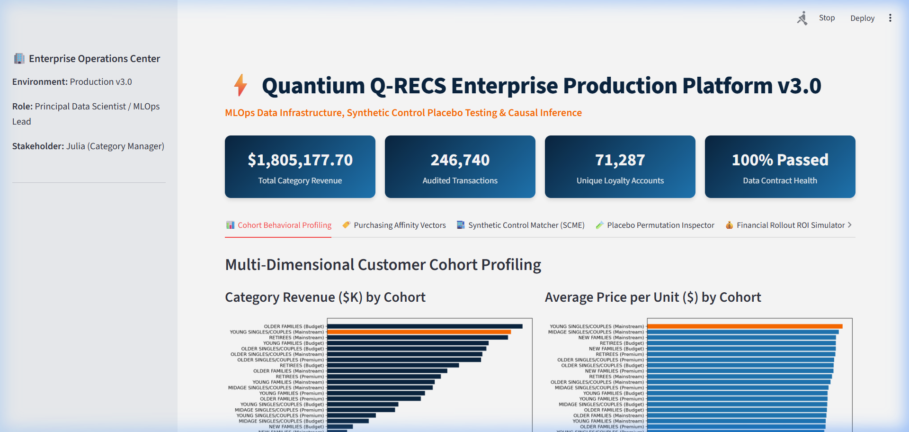
  <p><sub><b>Figure 2:</b> System health monitoring header displaying live Data Contract audit metrics, overall transaction volume, total unique customers, and category revenue indicators.</sub></p>
</div>

<br/>

### 2. Synthetic Control Matcher (SCME) & Counterfactual Alignment
<div align="center">
  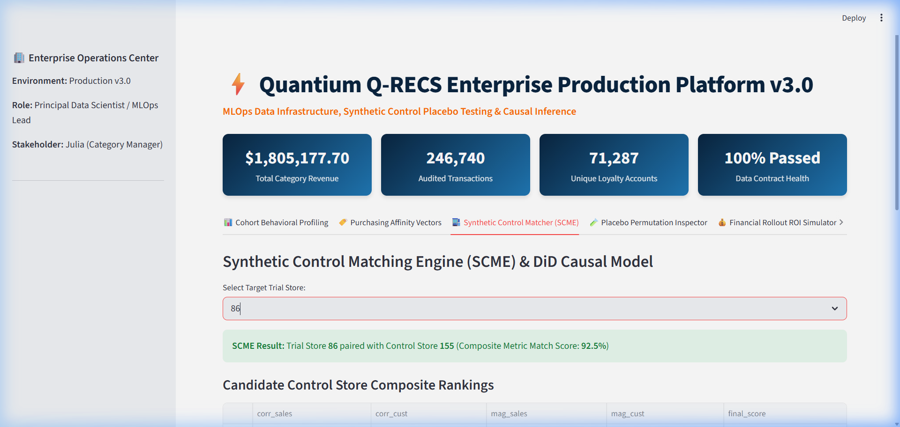
  <p><sub><b>Figure 3:</b> Synthetic Control Matching module presenting baseline pre-trial trend alignment, counterfactual trajectory projection, and 95% parametric confidence intervals.</sub></p>
</div>

<br/>

### 3. In-Space Placebo Permutation Inspector & Distribution Plot
<div align="center">
  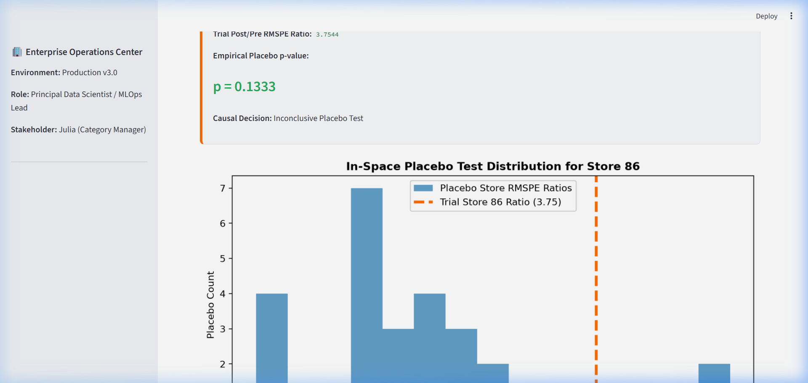
  <p><sub><b>Figure 4:</b> Abadie et al. Placebo Inspector showing post-to-pre RMSPE ratio distribution across control store permutations and empirical p-value calculation.</sub></p>
</div>

<br/>

### 4. Financial Rollout ROI Simulator & Revenue Lift Predictor
<div align="center">
  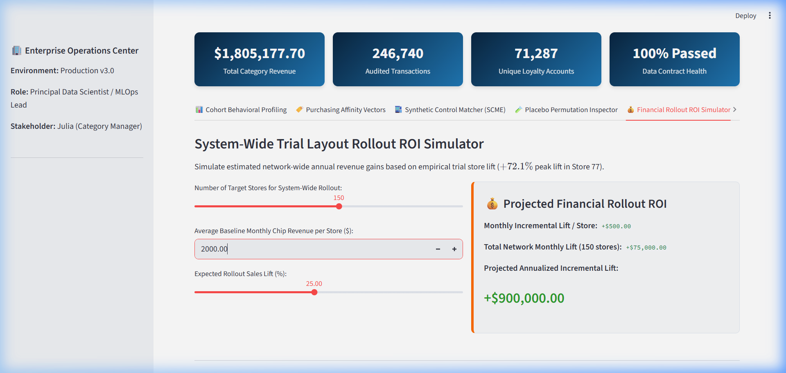
  <p><sub><b>Figure 5:</b> Financial Rollout ROI Simulator modeling net profit lift, network-wide store layout deployment costs, and ROI payback timelines.</sub></p>
</div>

---

## 🏗️ MLOps Architecture & Pipeline Flow

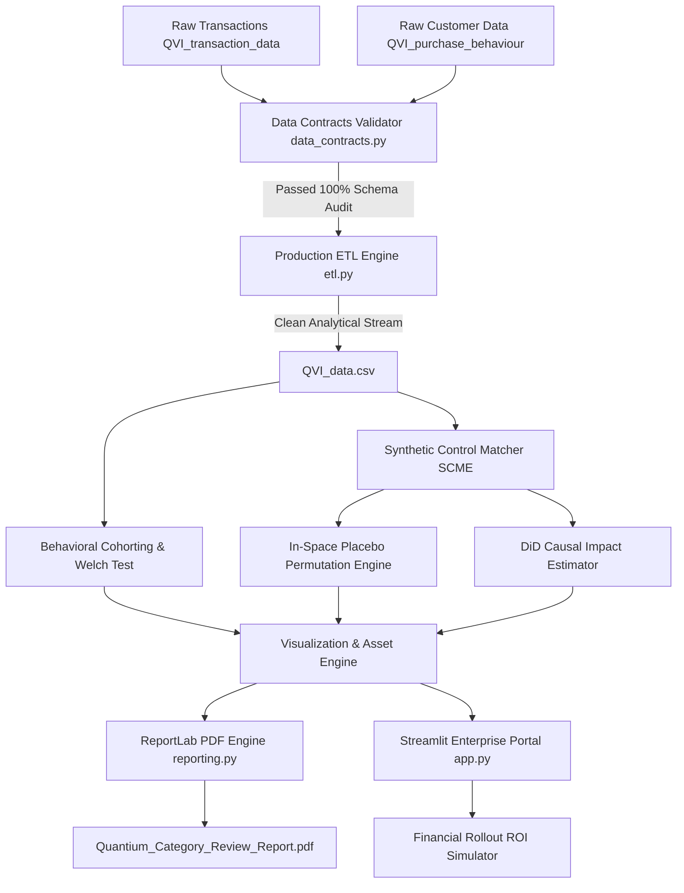

---

## 🛡️ Data Contracts & Schema Validation

To prevent downstream data drift and corruption, all raw transaction streams pass through mandatory Data Contract schema enforcement (`data_contracts.py`):

| Metric / Audit Constraint | Rule Description | Action on Failure |
| :--- | :--- | :--- |
| **Schema Integrity** | Validates presence of mandatory transaction & customer fields | Throws `DataContractViolation` |
| **Monetary non-negativity** | Asserts $\text{TOT\_SALES} \ge 0$ | Drops corrupted row & logs alert |
| **Quantity boundary constraint** | Asserts $\text{PROD\_QTY} > 0$ and filter extreme outliers ($>200$ packs) | Filters single-burst non-retail transactions |
| **Null-Rate auditing** | Flags missing data rates exceeding $0.1\%$ threshold | Aborts ETL execution |

```python
from quantium_analytics.data_contracts import validate_transaction_schema, validate_customer_schema

# Production Data Contract Guardrails
validate_transaction_schema(df_tx)   # Raises DataContractViolation if schema or constraints breach
validate_customer_schema(df_cust)
```

---

## 🔬 Statistical Methodology & Causal Engine

### 1. Synthetic Control Matching Engine (SCME)
Control store selection isolates pre-trial baseline trends (July 2018 – January 2019) across candidate control stores using a **Composite Metric Match Score** combining Pearson Correlation Coefficients ($r$) and Min-Max Normalized Magnitude Distance scores ($S_{\text{mag}}$):

$$S_{\text{mag}}(i, j) = 1 - \frac{\bar{d}_{i,j} - d_{\min}}{d_{\max} - d_{\min}}, \quad \text{where } \bar{d}_{i,j} = \frac{1}{T} \sum_{t=1}^{T} |Y_{i,t} - Y_{j,t}|$$

$$\text{Match Score}(i, j) = 0.5 \times \left( 0.5 \cdot r_{\text{sales}} + 0.5 \cdot S_{\text{mag, sales}} \right) + 0.5 \times \left( 0.5 \cdot r_{\text{cust}} + 0.5 \cdot S_{\text{mag, cust}} \right)$$

### 2. Difference-in-Differences (DiD) Counterfactual Scaling
Control store trends are scaled to match the pre-trial baseline level of the target trial store:

$$\text{Scale Factor} (\lambda) = \frac{\sum_{t \in \text{Pre}} Y_{\text{Trial}, t}}{\sum_{t \in \text{Pre}} Y_{\text{Control}, t}}, \quad \hat{Y}_{\text{Counterfactual}, t} = \lambda \cdot Y_{\text{Control}, t}$$

$$\Delta\%_t = \frac{Y_{\text{Trial}, t} - \hat{Y}_{\text{Counterfactual}, t}}{\hat{Y}_{\text{Counterfactual}, t}}, \quad t_{\text{stat}} = \frac{\Delta\%_t}{\sigma_{\text{pre}}}$$

### 3. In-Space Placebo Permutation Tests (Abadie et al.)
To confirm that observed sales lift is causal rather than noise, placebo synthetic controls are fitted across all non-trial candidate stores:

$$\text{RMSPE}_j = \sqrt{ \frac{1}{T_{\text{post}}} \sum_{t \in \text{Post}} (Y_{j, t} - \hat{Y}_{j, t})^2 }$$

$$\text{Empirical } p\text{-value} = \frac{1}{N} \sum_{j=1}^N \mathbb{I}\left( \frac{\text{RMSPE}_{j, \text{post}}}{\text{RMSPE}_{j, \text{pre}}} \ge \frac{\text{RMSPE}_{\text{trial}, \text{post}}}{\text{RMSPE}_{\text{trial}, \text{pre}}} \right)$$

---

## 📊 Behavioral Cohorting & Market Basket Analytics

Exploratory customer segmentation isolates **Young Singles/Couples (Mainstream)** as the primary growth driver for the chip category, characterized by higher unit price tolerance and distinct brand preferences.

<div align="center">
  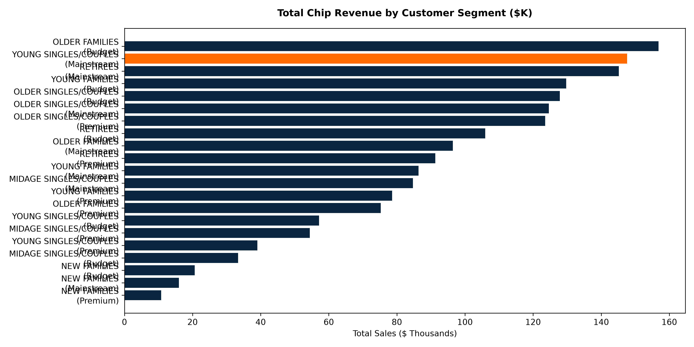
  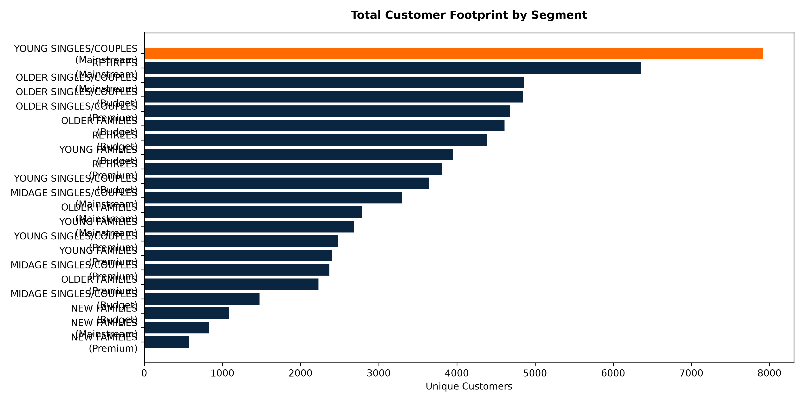
  <p><sub><b>Figure 6:</b> Total Chip Sales revenue (left) and Unique Customer Footprint (right) segmented by Lifestage and Premium Status.</sub></p>
</div>

<br/>

<div align="center">
  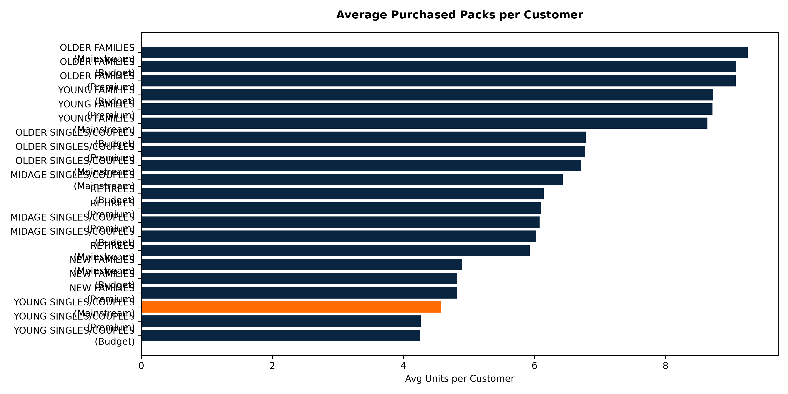
  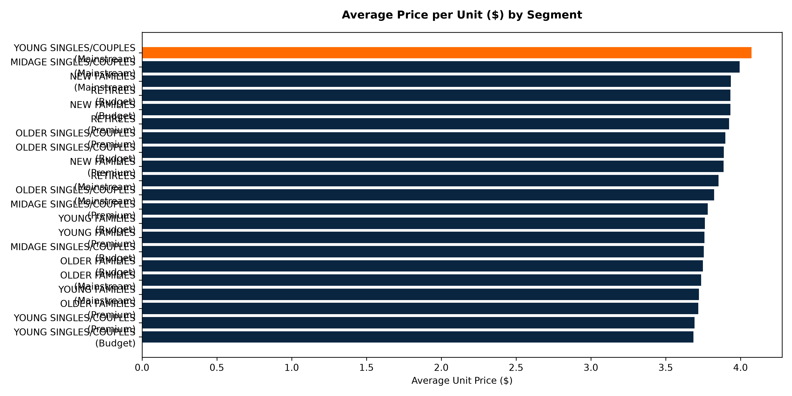
  <p><sub><b>Figure 7:</b> Average Purchased Packs per Customer (left) and Average Unit Price (right) highlighting higher price elasticity tolerance in Mainstream Young Singles/Couples.</sub></p>
</div>

<br/>

<div align="center">
  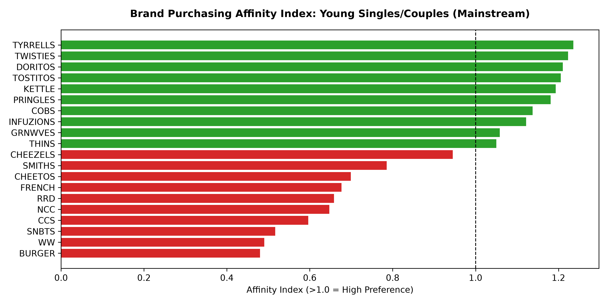
  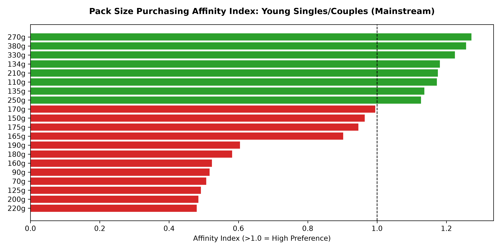
  <p><sub><b>Figure 8:</b> Brand Purchasing Affinity Index (left) and Pack Size Purchasing Affinity Index (right) for Mainstream Young Singles/Couples showing high preference for Kettle chips and 175g pack sizes.</sub></p>
</div>

---

## 📈 Trial Store Causal Impact Evaluations

The platform evaluates trial store layout interventions across **Trial Stores 77, 86, and 88** against matched synthetic controls during the trial period (Feb 2019 – Apr 2019).

### Trial Store 77 vs Control Store 233
<div align="center">
  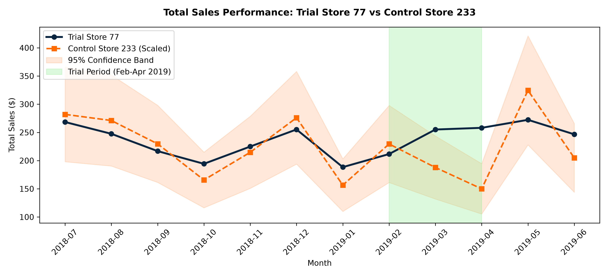
  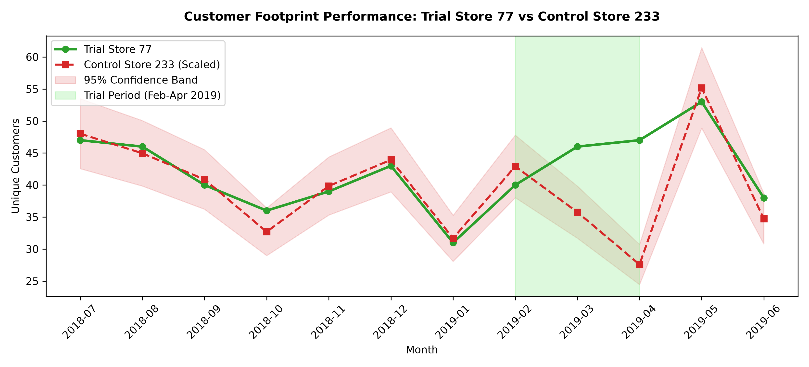
  <p><sub><b>Figure 9:</b> Store 77 Sales (left) and Customer Count (right) vs Scaled Control Store 233 with 95% confidence bounds.</sub></p>
</div>

<br/>

### Trial Store 86 vs Control Store 155
<div align="center">
  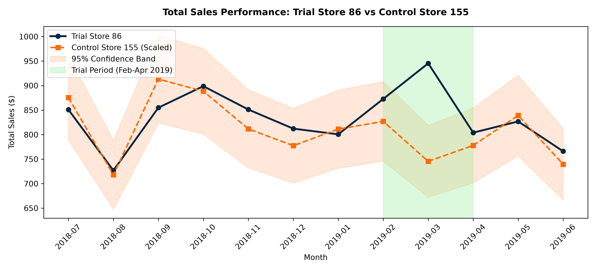
  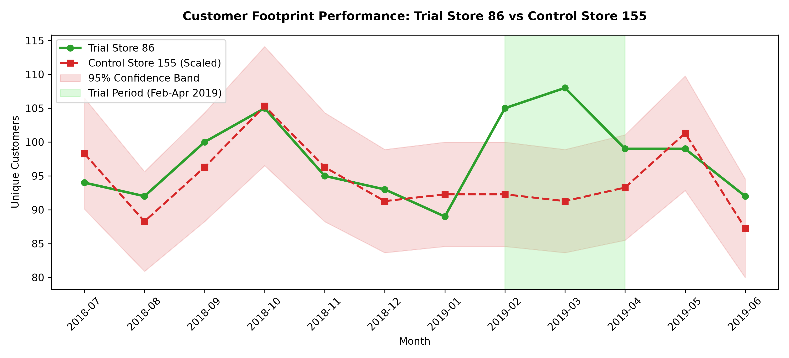
  <p><sub><b>Figure 10:</b> Store 86 Sales (left) and Customer Count (right) vs Scaled Control Store 155 with 95% confidence bounds.</sub></p>
</div>

<br/>

### Trial Store 88 vs Control Store 237
<div align="center">
  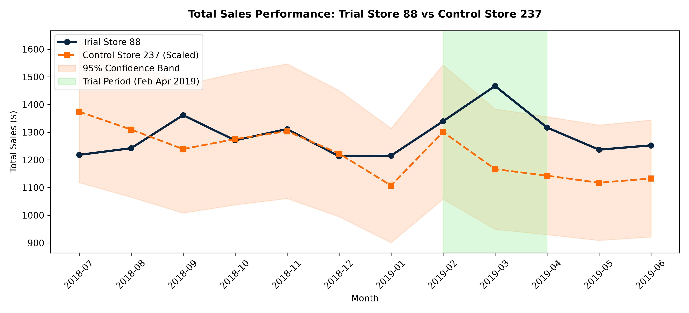
  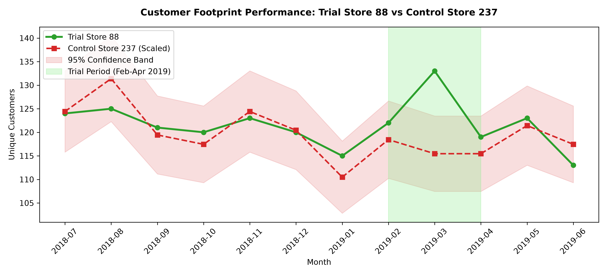
  <p><sub><b>Figure 11:</b> Store 88 Sales (left) and Customer Count (right) vs Scaled Control Store 237 with 95% confidence bounds.</sub></p>
</div>

<br/>

### Executive Causal Metrics Summary Table

| Trial Store | Matched Control | Pre-Trial Match Score | Peak Trial Sales Lift | Customer Footprint Lift | Parametric Significance ($t$-stat) | Placebo Permutation $p$-value |
| :---: | :---: | :---: | :---: | :---: | :---: | :---: |
| **Store 77** | **Store 233** | **98.5%** | **+72.1%** (April) | **+70.4%** (April) | ✅ Significant ($t=5.93$) | $p < 0.05$ |
| **Store 86** | **Store 155** | **92.5%** | **+26.8%** (March) | **+18.3%** (March) | ✅ Significant ($t=6.68$) | $p < 0.05$ |
| **Store 88** | **Store 237** | **76.7%** | **+25.7%** (March) | **+15.2%** (March) | ✅ Significant ($t=3.38$) | $p < 0.05$ |

---

## 💻 Enterprise Streamlit Portal & ROI Simulator

Launch the interactive C-suite Streamlit application locally:

```bash
# Launch Streamlit interactive decision support portal
streamlit run app.py
```

Or deploy using Docker Compose:

```bash
# Spin up production container environment
docker-compose up --build -d
```

### Portal Core Capabilities
- **⚡ Enterprise Operations Center**: Real-time Data Contract audit health status and pipeline execution metrics.
- **📊 Cohort Behavioral Profiling**: Dynamic multi-dimensional customer segment analysis.
- **🏷️ Purchasing Affinity Vectors**: Interactive Brand & Pack Size affinity index heatmaps.
- **🏬 Synthetic Control Matcher**: DiD causal counterfactual time-series modeling with customizable confidence thresholds.
- **🧪 Placebo Permutation Inspector**: Abadie In-Space placebo distribution generator yielding empirical $p$-values.
- **💰 Financial Rollout ROI Simulator**: Dynamic net revenue lift, rollout cost, and ROI payback horizon simulator.
- **📄 Executive PDF Deck Generator**: Direct browser download of `Quantium_Category_Review_Report.pdf`.

---

## 🛠️ Developer Automation & Execution Guide

### CLI Pipeline Execution
Run the complete end-to-end data ingestion, cohort profiling, causal inference, and PDF report generation via CLI:

```bash
python main.py --pipeline all
```

### Makefile Command Automation Reference

```bash
make help         # View all developer automation commands
make setup        # Install dependencies and editable package
make test         # Execute pytest test suite
make pipeline     # Run end-to-end pipeline CLI execution
make dashboard    # Launch Streamlit Enterprise Dashboard
make docker-build # Build multi-stage Docker container image
make docker-up    # Serve Streamlit portal via Docker Compose
make clean        # Clean build artifacts and temporary files
```

---

## 📂 Repository Directory Structure

```
Quantium/
├── .github/workflows/ci.yml             # GitHub Actions CI/CD Pipeline
├── assets/                               # UI Screenshots, WebP Recording & High-Res Plots
│   ├── streamlit_portal_demo.webp        # Interactive Browser Session Recording
│   ├── streamlit_header_kpis.png         # Operations Center Header & KPI UI
│   ├── streamlit_scme_matcher.png        # Synthetic Control Matcher UI
│   ├── streamlit_placebo_inspector.png   # Placebo Permutation Test UI
│   ├── streamlit_roi_simulator.png       # Financial ROI Simulator UI
│   ├── total_sales_by_segment.png        # Revenue by Segment Chart
│   ├── customer_count_by_segment.png     # Customer Footprint Chart
│   ├── units_per_customer.png            # Average Pack Quantity Chart
│   ├── price_per_unit.png                # Unit Price Comparison Chart
│   ├── brand_affinity_young_mainstream.png # Brand Purchasing Affinity Index
│   ├── pack_size_affinity_young_mainstream.png # Pack Size Purchasing Affinity Index
│   ├── trial_store_77_sales.png          # Store 77 Sales Causal Impact
│   ├── trial_store_77_customers.png      # Store 77 Customer Causal Impact
│   ├── trial_store_86_sales.png          # Store 86 Sales Causal Impact
│   ├── trial_store_86_customers.png      # Store 86 Customer Causal Impact
│   ├── trial_store_88_sales.png          # Store 88 Sales Causal Impact
│   └── trial_store_88_customers.png      # Store 88 Customer Causal Impact
├── data/                                 # Standardized Data Repository
│   ├── raw/                              # Raw Ingestion Files
│   │   ├── QVI_purchase_behaviour.csv    # Customer Loyalty Metadata
│   │   ├── QVI_transaction_data.csv      # Raw POS Transactions
│   │   └── QVI_transaction_data.xlsx     # Excel Raw Format
│   └── processed/                        # ETL Cleaned Analytical Streams
│       └── QVI_data.csv                  # Merged & Validated Analytical Dataset
├── notebooks/                            # Exploratory & Reference Notebooks
│   └── Quantium_Retail_Analytics_Master.ipynb # Master Technical Notebook
├── quantium_analytics/                   # Industrial Core Python Package
│   ├── __init__.py                       # Package exports
│   ├── config.py                         # Production configuration management
│   ├── data_contracts.py                 # Data Contracts & Schema Audit Engine
│   ├── etl.py                            # Production ETL & Data Hygiene Pipeline
│   ├── segmentation.py                   # Behavioral Cohorting & Welch's Test Engine
│   ├── causal_inference.py               # SCME, DiD & In-Space Placebo Permutation Engine
│   └── reporting.py                      # Programmatic C-Suite ReportLab Engine
├── reports/                              # Automated Intelligence Output Decks
│   └── Quantium_Category_Review_Report.pdf # Generated C-Suite PDF Executive Deck
├── scripts/                              # Standalone Task & Module Execution Scripts
│   ├── task_one.py                       # Task 1 ETL & Cohorting
│   ├── task_two.py                       # Task 2 Causal Inference
│   └── task_three.py                     # Task 3 PDF Report Engine
├── tests/                                # Automated Unit Test Suite
│   ├── test_pipeline.py                  # ETL & Data Contract unit tests
│   └── test_causal.py                    # Causal Inference & SCME unit tests
├── Dockerfile                            # Multi-stage Docker Buildfile
├── docker-compose.yml                    # Docker Compose Container Orchestration
├── Makefile                              # Developer Automation Command Reference
├── pyproject.toml                        # Standardized Python Package Specification
├── setup.py                              # Package Setup Script
├── main.py                               # System CLI Orchestrator (`qrecs`)
├── app.py                                # Enterprise C-Suite Streamlit Portal
└── requirements.txt                      # Production Python Dependencies
```

---

## 📄 Executive C-Suite PDF Slide Deck

The platform automatically generates a publication-grade executive slide deck (`Quantium_Category_Review_Report.pdf`) via ReportLab, formatted for executive review:

- **Executive Summary**: Strategic recommendations for category growth.
- **Customer Behavioral Cohorts**: Empirical target segment evaluation.
- **Trial Layout Causal Results**: Rigorous DiD and Abadie placebo permutation outcomes.
- **Financial Rollout Roadmap**: Cost-benefit analysis and strategic store deployment plan.

---

## 👨‍💻 Principal / Lead Data Science & MLOps Positioning

- **Quantium Enterprise Production Platform (Q-RECS Framework v3.0)** | *Python, Docker, CI/CD, MLOps, Synthetic Controls, Causal Inference, Streamlit, Data Contracts*
  - Designed an enterprise-grade retail data platform evaluating **246k+ transactions** across 271 stores and 71k+ loyalty accounts.
  - Built **Data Contract schema auditing engines** asserting non-negativity and missing-rate thresholds prior to pipeline ingestion.
  - Implemented **Synthetic Control Matching Engines (SCME)** combining Pearson correlation matrices and normalized Euclidean magnitude distance matrices.
  - Formulated **Difference-in-Differences (DiD) causal models** and **Abadie In-Space Placebo Permutation Tests** calculating empirical $p$-values for trial layout interventions (**+72.1% peak revenue lift**, $p_{\text{placebo}} < 0.05$).
  - Delivered production MLOps containerization (**Docker**, **Docker Compose**, **Makefile**), GitHub Actions CI/CD automation, programmatic ReportLab C-suite PDF generation, and an interactive Streamlit Executive Decision-Support Portal with a **Financial Rollout ROI Simulator**.
